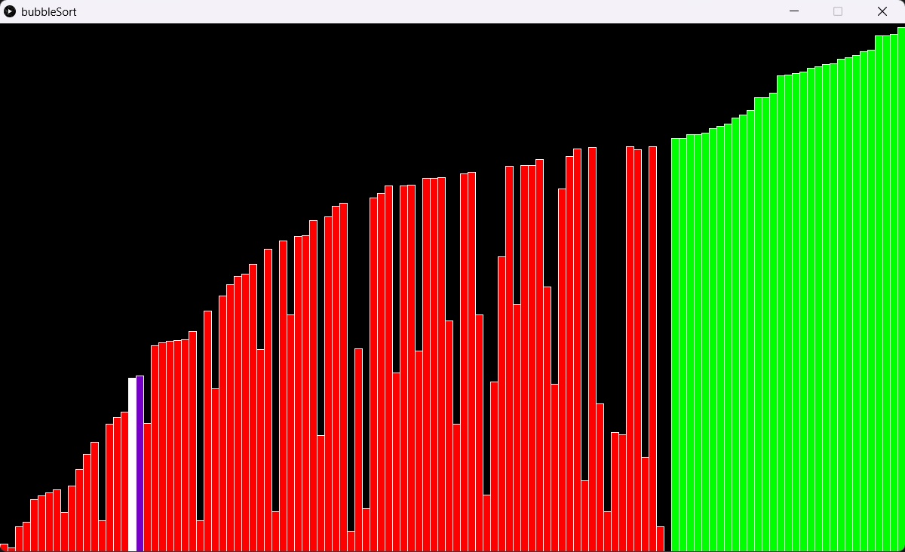
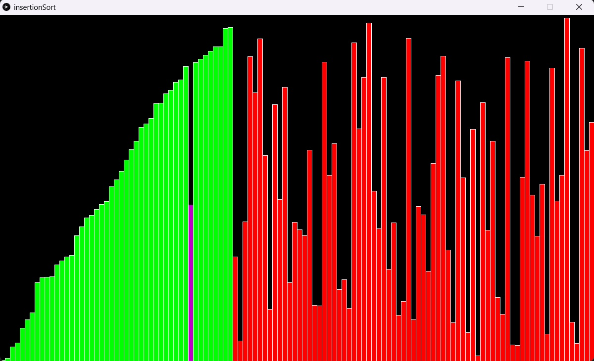
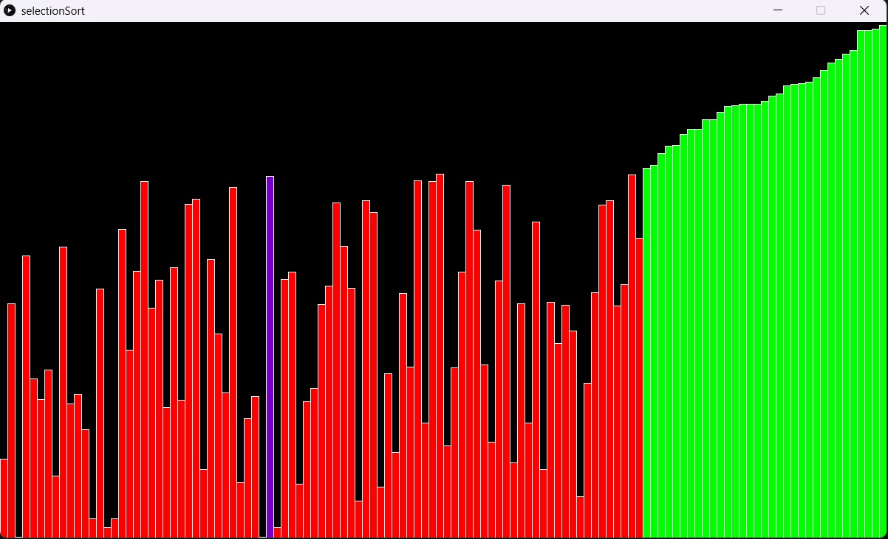

# Sorting Algorithm Visualizer

This project is a sorting algorithm visualizer implemented in Processing, a Java-based programming language. It allows you to visualize the sorting process of three common algorithms: Bubble Sort, Insertion Sort, and Selection Sort.

## Introduction

Sorting algorithms are fundamental in computer science and are used to organize data in a specific order. This visualizer aims to help understand the inner workings of three popular sorting algorithms: Bubble Sort, Insertion Sort, and Selection Sort.

The visualization demonstrates the step-by-step process of how these algorithms rearrange elements to sort an array of numbers. It provides a graphical representation of the current state of the array during each comparison and swapping operation.

## Installation

To run the visualizer on your local machine, follow these steps:

1. Ensure you have Processing installed. If not, you can download it from the official website: [https://processing.org/download](https://processing.org/download).

2. Clone this repository to your local machine.

## Usage

To run the visualizer for each sorting algorithm individually, follow these steps:

1. Open the corresponding `.pde` file for the sorting algorithm you want to visualize. The files are located in their respective folders (`BubbleSort`, `InsertionSort`, `SelectionSort`).

2. Click on the "Run" button or press `Ctrl + R` to start the visualizer for the selected sorting algorithm.

Please note that each sorting algorithm has its own separate folder containing the corresponding `.pde` file.
